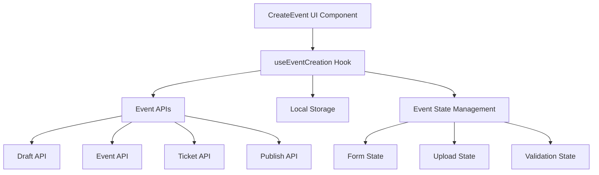
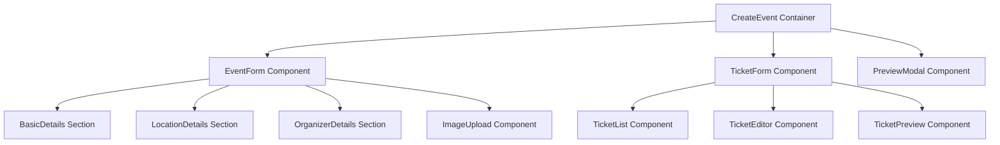

# Event Creation Integration - Design Document

## Overview

The Event Creation Integration feature transforms the existing CreateEvent UI component into a fully functional event management system. The design integrates with multiple backend APIs to provide vendors with a comprehensive event creation workflow, from initial draft creation through ticket configuration to final publication.

The system follows a progressive enhancement approach, allowing vendors to save work incrementally while building toward a complete, publishable event.

## Architecture

### High-Level Architecture



### Component Architecture



## Components and Interfaces

### Design System Integration

The Event Creation Integration follows the established REVLR design language:

**Color Palette:**

- Primary: `revlr-primary-blue` (#0066FF)
- Secondary: `revlr-accent-purple`, `revlr-accent-green`, `revlr-accent-orange`
- Accent: `revlr-primary-yellow`
- Dark Mode: `revlr-dark-bg`, `revlr-dark-card`, `revlr-dark-border`

**Typography:**

- Primary: `font-inter` for body text and UI elements
- Brand: `font-montserrat` for headings and brand elements

**Component Styling:**

- Buttons: Gradient backgrounds `bg-gradient-to-r from-revlr-primary-blue to-revlr-accent-purple`
- Cards: `rounded-xl` with `shadow-lg` and theme-aware backgrounds
- Inputs: `rounded-xl` with focus states using `focus:ring-revlr-primary-blue/20`
- Transitions: `transition-all duration-200` for smooth interactions

### Core Hook: useEventCreation

```typescript
interface UseEventCreationProps {
    eventId?: string; // For editing existing events
    initialData?: Partial<EventCreationData>;
}

interface UseEventCreationReturn {
    // State
    eventData: EventCreationData;
    tickets: EventTicket[];
    currentStep: number;
    isLoading: boolean;
    isSaving: boolean;
    errors: ValidationErrors;

    // Actions
    updateEventData: (data: Partial<EventCreationData>) => void;
    addTicket: (ticket: EventTicketCreationRequest) => Promise<void>;
    updateTicket: (
        ticketId: string,
        updates: Partial<EventTicket>
    ) => Promise<void>;
    removeTicket: (ticketId: string) => Promise<void>;
    saveDraft: () => Promise<void>;
    publishEvent: () => Promise<void>;

    // Navigation
    goToStep: (step: number) => void;
    canProceedToStep: (step: number) => boolean;

    // Validation
    validateCurrentStep: () => ValidationResult;
    validateForPublishing: () => ValidationResult;
}
```

### Event Data Models

```typescript
interface EventCreationData {
    // Basic Information
    title: string;
    description: string;
    category: EventCategory;

    // Date and Time
    startDate: string;
    endDate: string;
    startTime: string;
    endTime: string;
    timezone: string;

    // Location
    locationType: LocationType;
    venue?: VenueDetails;
    virtualLink?: string;

    // Images
    images: EventImage[];

    // Organizer
    organizer: OrganizerDetails;

    // Social Links
    socialLinks: SocialLinks;

    // Metadata
    status: 'draft' | 'published';
    createdAt?: string;
    updatedAt?: string;
}

interface EventTicket {
    id?: string;
    name: string;
    description?: string;
    price: number;
    quantity: number;
    salesStartDate: string;
    salesEndDate: string;
    purchaseLimit?: number;
    isActive: boolean;
}
```

### API Integration Layer

```typescript
class EventCreationService {
    // Draft Management
    static async saveDraft(data: EventCreationRequest): Promise<EventView>;
    static async loadDraft(eventId: string): Promise<EventView>;

    // Event Management
    static async createEvent(data: EventCreationRequest): Promise<EventView>;
    static async updateEvent(
        eventId: string,
        data: EventCreationRequest
    ): Promise<EventView>;

    // Ticket Management
    static async addTickets(
        eventId: string,
        tickets: EventTicketCreationRequest[]
    ): Promise<EventView>;

    // Publishing
    static async publishEvent(eventId: string): Promise<EventView>;

    // Image Upload
    static async uploadImage(file: File): Promise<string>;
}
```

## Data Models

### Event Creation Request

```typescript
interface EventCreationRequest {
    title: string;
    description: string;
    category: string;
    startDate: string;
    endDate: string;
    locationDetails: LocationDetails;
    socialLinks?: EventSocialLinks;
    customFields?: CustomField[];
    organizerInfo?: {
        name: string;
        website?: string;
        logo?: string;
    };
}
```

### Location Details

```typescript
interface LocationDetails {
    type: LocationType; // 0=In-Person, 1=Virtual, 2=Hybrid
    venue?: {
        name: string;
        address: AddressInfo;
        googleMapsUrl?: string;
    };
    virtualDetails?: {
        platform: string;
        link: string;
        accessInstructions?: string;
    };
}
```

### Ticket Creation Request

```typescript
interface EventTicketCreationRequest {
    name: string;
    description?: string;
    price: number;
    quantity: number;
    salesPeriod: TicketSalesPeriod;
    purchaseLimit?: number;
    isTransferable?: boolean;
    refundPolicy?: string;
}
```

## Error Handling

### Error Types and Handling Strategy

```typescript
enum EventCreationErrorType {
    VALIDATION_ERROR = 'validation_error',
    NETWORK_ERROR = 'network_error',
    AUTHENTICATION_ERROR = 'auth_error',
    SERVER_ERROR = 'server_error',
    UPLOAD_ERROR = 'upload_error',
}

interface EventCreationError {
    type: EventCreationErrorType;
    message: string;
    field?: string;
    details?: any;
}
```

### Error Recovery Strategies

1. **Network Errors**: Implement exponential backoff retry mechanism
2. **Validation Errors**: Show inline field-specific error messages
3. **Upload Errors**: Provide retry functionality with progress indication
4. **Authentication Errors**: Redirect to login while preserving form data
5. **Server Errors**: Show user-friendly messages with support contact information

### Local Storage Backup

```typescript
interface DraftBackup {
    eventData: EventCreationData;
    tickets: EventTicket[];
    timestamp: number;
    step: number;
}

class DraftBackupService {
    static saveDraft(data: DraftBackup): void;
    static loadDraft(): DraftBackup | null;
    static clearDraft(): void;
    static hasDraft(): boolean;
}
```

## Testing Strategy

### Unit Testing

1. **Hook Testing**: Test useEventCreation hook with various scenarios
2. **Component Testing**: Test individual form components and validation
3. **Service Testing**: Test API integration layer with mocked responses
4. **Utility Testing**: Test validation functions and data transformations

### Integration Testing

1. **Form Flow Testing**: Test complete event creation workflow
2. **API Integration Testing**: Test actual API calls with test data
3. **Error Handling Testing**: Test error scenarios and recovery
4. **Draft Persistence Testing**: Test local storage functionality

### End-to-End Testing

1. **Complete Workflow**: Test full event creation from start to publication
2. **Cross-Browser Testing**: Ensure compatibility across browsers
3. **Mobile Responsiveness**: Test on various device sizes
4. **Performance Testing**: Test with large images and complex forms

## Implementation Phases

### Phase 1: Core Integration (Week 1-2)

1. Create useEventCreation hook with basic functionality
2. Integrate draft saving with existing CreateEvent component
3. Implement basic form validation and error handling
4. Add local storage backup functionality

### Phase 2: Ticket Management (Week 2-3)

1. Integrate ticket creation API
2. Implement ticket editing and deletion
3. Add ticket validation and preview functionality
4. Create ticket management UI components

### Phase 3: Publishing and Polish (Week 3-4)

1. Implement event publishing workflow
2. Add comprehensive error handling and recovery
3. Implement image upload and management
4. Add form auto-save and recovery features

### Phase 4: Enhancement and Testing (Week 4-5)

1. Add advanced validation and user guidance
2. Implement comprehensive testing suite
3. Add performance optimizations
4. Polish UI/UX based on testing feedback

## Security Considerations

### Authentication and Authorization

1. **Vendor Verification**: Ensure only authenticated vendors can create events
2. **Session Management**: Handle session expiration gracefully
3. **CSRF Protection**: Implement proper CSRF tokens for form submissions
4. **Input Sanitization**: Sanitize all user inputs before API submission

### Data Protection

1. **Sensitive Data**: Ensure payment information is handled securely
2. **Image Upload**: Validate and sanitize uploaded images
3. **Local Storage**: Encrypt sensitive data in local storage
4. **API Communication**: Use HTTPS for all API communications

## Performance Considerations

### Optimization Strategies

1. **Lazy Loading**: Load form sections and components as needed
2. **Image Optimization**: Compress and resize images before upload
3. **Debounced Saving**: Implement debounced auto-save functionality
4. **Caching**: Cache form data and validation results appropriately

### Monitoring and Metrics

1. **Performance Metrics**: Track form completion times and success rates
2. **Error Tracking**: Monitor and log errors for debugging
3. **User Analytics**: Track user behavior and form abandonment
4. **API Performance**: Monitor API response times and failure rates

## Design System Components

### Enhanced CreateEvent Component Structure

```typescript
// Updated component structure following REVLR design language
const CreateEventContainer = () => {
  const { theme } = useTheme();

  return (
    <div className={`min-h-screen transition-colors duration-200 ${
      theme === 'dark'
        ? 'bg-revlr-dark-bg text-white'
        : 'bg-gray-50 text-gray-900'
    }`}>
      {/* Header with progress indicator */}
      <EventCreationHeader />

      {/* Main form content */}
      <div className="p-6 space-y-6">
        <EventCreationForm />
      </div>
    </div>
  );
};
```

### Form Section Cards

```typescript
const FormSection = ({ title, required, children }) => {
  const { theme } = useTheme();

  return (
    <div className={`p-8 rounded-xl border shadow-lg ${
      theme === 'dark'
        ? 'bg-revlr-dark-card border-revlr-dark-border'
        : 'bg-white border-gray-200'
    }`}>
      <label className="mb-6 block font-inter text-lg font-semibold">
        {required && <span className="mr-2 text-revlr-accent-orange">*</span>}
        {title}
      </label>
      {children}
    </div>
  );
};
```

### Primary Action Buttons

```typescript
const PrimaryButton = ({ children, loading, ...props }) => (
  <button
    className="rounded-xl bg-gradient-to-r from-revlr-primary-blue to-revlr-accent-purple px-8 py-3 font-inter font-semibold text-white shadow-lg transition-all duration-200 hover:from-revlr-primary-blue/90 hover:to-revlr-accent-purple/90 hover:shadow-xl disabled:opacity-50 disabled:cursor-not-allowed"
    disabled={loading}
    {...props}
  >
    {loading ? <LoadingSpinner /> : children}
  </button>
);
```

### Form Input Components

```typescript
const FormInput = ({ label, error, required, ...props }) => {
  const { theme } = useTheme();

  return (
    <div className="space-y-2">
      <label className="font-inter text-sm font-medium">
        {required && <span className="mr-1 text-revlr-accent-orange">*</span>}
        {label}
      </label>
      <input
        className={`w-full rounded-xl border px-4 py-3 font-inter text-sm transition-all duration-200 ${
          error
            ? 'border-red-500 focus:ring-red-500/20'
            : theme === 'dark'
              ? 'border-revlr-dark-border bg-revlr-dark-card text-white focus:border-revlr-primary-blue focus:ring-revlr-primary-blue/20'
              : 'border-gray-300 bg-white focus:border-revlr-primary-blue focus:ring-revlr-primary-blue/20'
        } focus:outline-none focus:ring-2`}
        {...props}
      />
      {error && (
        <p className="font-inter text-sm text-red-500">{error}</p>
      )}
    </div>
  );
};
```

## Accessibility Features

### WCAG Compliance

1. **Keyboard Navigation**: Ensure all form elements are keyboard accessible
2. **Screen Reader Support**: Provide proper ARIA labels and descriptions
3. **Color Contrast**: Ensure sufficient contrast for all UI elements using REVLR color palette
4. **Focus Management**: Implement proper focus management with `focus:ring-revlr-primary-blue/20`

### User Experience Enhancements

1. **Progress Indicators**: Multi-step progress bar with REVLR gradient styling
2. **Help Text**: Contextual tooltips with dark mode support
3. **Error Guidance**: Inline validation with REVLR error colors
4. **Mobile Optimization**: Responsive design following REVLR mobile patterns
5. **Theme Support**: Full dark/light mode integration with REVLR theme system

## Migration and Deployment

### Deployment Strategy

1. **Feature Flags**: Use feature flags to control rollout
2. **Gradual Rollout**: Deploy to small percentage of users initially
3. **Monitoring**: Monitor for errors and performance issues
4. **Rollback Plan**: Have clear rollback procedures if issues arise

### Data Migration

1. **Existing Drafts**: Handle any existing draft data appropriately
2. **User Preferences**: Migrate user preferences and settings
3. **Backward Compatibility**: Ensure compatibility with existing event data
4. **Testing**: Thoroughly test migration procedures

This design provides a comprehensive foundation for implementing the Event Creation Integration feature while maintaining high standards for user experience, security, and performance.
