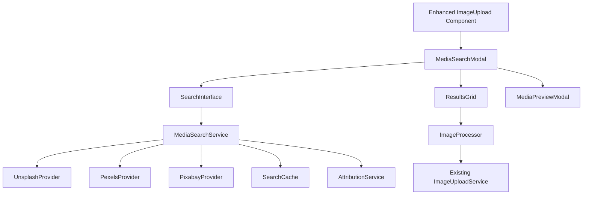
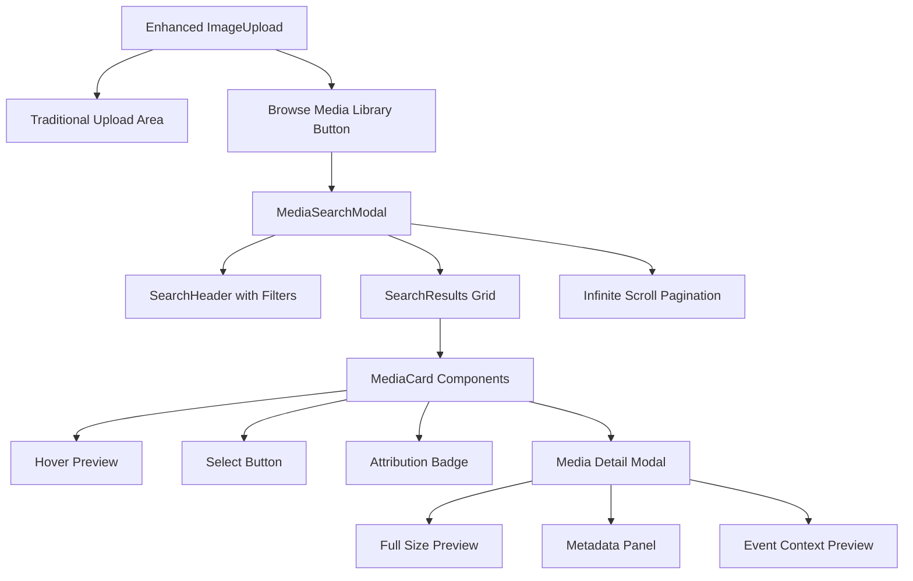

# Event Media Search Integration - Design Document

## Overview

The Event Media Search Integration feature extends the existing ImageUpload component to provide seamless access to high-quality images and videos from open source providers like Unsplash, Pexels, and Pixabay. The design integrates directly into the current event creation workflow, allowing vendors to discover, preview, and select professional media without disrupting their existing process.

The system follows a provider-agnostic architecture that enables easy integration of additional media sources while maintaining consistent user experience and performance standards.

## Architecture

### High-Level Architecture



### Component Architecture



## Components and Interfaces

### Enhanced ImageUpload Component

The existing ImageUpload component will be enhanced with a new "Browse Media Library" option:

```typescript
interface EnhancedImageUploadProps extends ImageUploadProps {
    enableMediaSearch?: boolean;
    mediaSearchConfig?: MediaSearchConfig;
}

interface MediaSearchConfig {
    providers: MediaProvider[];
    defaultSearchTerms?: string[];
    categoryMapping?: Record<string, string[]>;
    maxResultsPerProvider?: number;
}
```

### Media Search Service

```typescript
interface MediaSearchService {
    // Search functionality
    searchMedia(query: MediaSearchQuery): Promise<MediaSearchResult>;
    getPopularMedia(category?: string): Promise<MediaSearchResult>;
    getSuggestions(query: string): Promise<string[]>;

    // Provider management
    getAvailableProviders(): MediaProvider[];
    getProviderStatus(providerId: string): ProviderStatus;

    // Caching and performance
    clearCache(): void;
    preloadPopularSearches(): Promise<void>;
}

interface MediaSearchQuery {
    query: string;
    providers?: string[];
    filters?: MediaFilters;
    page?: number;
    perPage?: number;
}

interface MediaFilters {
    orientation?: 'landscape' | 'portrait' | 'square';
    color?: string;
    category?: string;
    minWidth?: number;
    minHeight?: number;
    mediaType?: 'image' | 'video';
}

interface MediaSearchResult {
    items: MediaItem[];
    totalResults: number;
    hasMore: boolean;
    nextPage?: number;
    providers: ProviderResult[];
}

interface MediaItem {
    id: string;
    providerId: string;
    title: string;
    description?: string;
    thumbnailUrl: string;
    previewUrl: string;
    downloadUrl: string;
    width: number;
    height: number;
    fileSize?: number;
    mediaType: 'image' | 'video';
    attribution: AttributionInfo;
    license: LicenseInfo;
    tags: string[];
    color?: string;
    photographer?: {
        name: string;
        profileUrl?: string;
        avatarUrl?: string;
    };
}
```

### Provider Architecture

```typescript
abstract class MediaProvider {
    abstract readonly id: string;
    abstract readonly name: string;
    abstract readonly baseUrl: string;
    abstract readonly rateLimit: RateLimit;

    abstract search(query: MediaSearchQuery): Promise<ProviderResult>;
    abstract getPopular(category?: string): Promise<ProviderResult>;
    abstract downloadMedia(item: MediaItem): Promise<Blob>;

    // Rate limiting and error handling
    protected checkRateLimit(): boolean;
    protected handleError(error: unknown): ProviderError;
}

class UnsplashProvider extends MediaProvider {
    readonly id = 'unsplash';
    readonly name = 'Unsplash';
    readonly baseUrl = 'https://api.unsplash.com';
    readonly rateLimit = { requests: 50, window: 3600 }; // 50 per hour

    async search(query: MediaSearchQuery): Promise<ProviderResult> {
        // Implementation for Unsplash API
    }

    async getPopular(category?: string): Promise<ProviderResult> {
        // Implementation for Unsplash popular/featured photos
    }
}

class PexelsProvider extends MediaProvider {
    readonly id = 'pexels';
    readonly name = 'Pexels';
    readonly baseUrl = 'https://api.pexels.com';
    readonly rateLimit = { requests: 200, window: 3600 }; // 200 per hour

    // Similar implementation for Pexels
}

class PixabayProvider extends MediaProvider {
    readonly id = 'pixabay';
    readonly name = 'Pixabay';
    readonly baseUrl = 'https://pixabay.com/api';
    readonly rateLimit = { requests: 100, window: 3600 }; // 100 per hour

    // Similar implementation for Pixabay
}
```

### Attribution and Licensing

```typescript
interface AttributionInfo {
    required: boolean;
    text?: string;
    linkUrl?: string;
    placement: 'event-description' | 'image-caption' | 'footer' | 'none';
}

interface LicenseInfo {
    type: 'cc0' | 'unsplash' | 'pexels' | 'pixabay-standard';
    name: string;
    url: string;
    commercialUse: boolean;
    attribution: AttributionInfo;
    restrictions?: string[];
}

class AttributionService {
    static generateAttributionText(item: MediaItem): string;
    static validateLicenseForCommercialUse(license: LicenseInfo): boolean;
    static getAttributionPlacement(license: LicenseInfo): string;
    static formatAttributionForEvent(
        item: MediaItem,
        eventData: EventCreationData
    ): string;
}
```

## Data Models

### Extended Event Image Model

```typescript
interface EventImage {
    // Existing properties
    id: string;
    url: string;
    cdnUrl?: string;
    name: string;
    size: number;
    mimeType: string;
    order: number;

    // New properties for external media
    source?: 'upload' | 'external';
    providerId?: string;
    originalId?: string;
    attribution?: AttributionInfo;
    license?: LicenseInfo;
    photographer?: {
        name: string;
        profileUrl?: string;
    };
    downloadedAt?: string;
    originalUrl?: string;
}
```

### Search State Management

```typescript
interface MediaSearchState {
    // Search state
    query: string;
    filters: MediaFilters;
    results: MediaSearchResult | null;
    isLoading: boolean;
    error: string | null;

    // UI state
    selectedItems: MediaItem[];
    previewItem: MediaItem | null;
    currentPage: number;
    hasMore: boolean;

    // Provider state
    availableProviders: MediaProvider[];
    activeProviders: string[];
    providerErrors: Record<string, string>;
}

interface MediaSearchActions {
    search: (query: string, filters?: MediaFilters) => Promise<void>;
    loadMore: () => Promise<void>;
    selectItem: (item: MediaItem) => void;
    deselectItem: (itemId: string) => void;
    previewItem: (item: MediaItem) => void;
    closePreview: () => void;
    applyFilters: (filters: MediaFilters) => Promise<void>;
    clearSearch: () => void;
    downloadSelected: () => Promise<EventImage[]>;
}
```

## User Interface Design

### Media Search Modal

The media search will be presented in a full-screen modal that integrates seamlessly with the REVLR design system:

```typescript
const MediaSearchModal: React.FC<MediaSearchModalProps> = ({
    isOpen,
    onClose,
    onSelectMedia,
    eventCategory,
    existingImages
}) => {
    const { theme } = useTheme();

    return (
        <div className={`fixed inset-0 z-50 ${theme === 'dark' ? 'bg-revlr-dark-bg' : 'bg-white'}`}>
            {/* Header with search and filters */}
            <MediaSearchHeader />

            {/* Main content area */}
            <div className="flex h-full">
                {/* Sidebar with filters and categories */}
                <MediaSearchSidebar />

                {/* Results grid */}
                <MediaSearchResults />

                {/* Selected items panel */}
                <SelectedMediaPanel />
            </div>

            {/* Footer with actions */}
            <MediaSearchFooter />
        </div>
    );
};
```

### Search Interface Components

```typescript
// Search header with intelligent suggestions
const MediaSearchHeader: React.FC = () => (
    <div className="border-b border-revlr-dark-border bg-revlr-dark-card p-6">
        <div className="flex items-center space-x-4">
            <SearchInput
                placeholder="Search for images and videos..."
                suggestions={searchSuggestions}
                onSearch={handleSearch}
            />
            <FilterButton onClick={toggleFilters} />
            <ProviderSelector providers={availableProviders} />
        </div>

        {/* Quick category suggestions based on event category */}
        <CategorySuggestions eventCategory={eventCategory} />
    </div>
);

// Responsive results grid with infinite scroll
const MediaSearchResults: React.FC = () => (
    <div className="flex-1 overflow-y-auto p-6">
        <InfiniteScroll
            hasMore={hasMore}
            loadMore={loadMore}
            loader={<MediaGridSkeleton />}
        >
            <div className="grid grid-cols-2 gap-4 sm:grid-cols-3 md:grid-cols-4 lg:grid-cols-5 xl:grid-cols-6">
                {results.map(item => (
                    <MediaCard
                        key={`${item.providerId}-${item.id}`}
                        item={item}
                        onSelect={handleSelect}
                        onPreview={handlePreview}
                        isSelected={selectedItems.includes(item.id)}
                    />
                ))}
            </div>
        </InfiniteScroll>
    </div>
);

// Individual media card with hover effects
const MediaCard: React.FC<MediaCardProps> = ({ item, onSelect, onPreview, isSelected }) => (
    <div className={`group relative aspect-square overflow-hidden rounded-xl border-2 transition-all duration-200 ${
        isSelected
            ? 'border-revlr-primary-blue ring-2 ring-revlr-primary-blue/20'
            : 'border-transparent hover:border-revlr-primary-blue/50'
    }`}>
        

        {/* Overlay with actions */}
        <div className="absolute inset-0 bg-gradient-to-t from-black/60 via-transparent to-transparent opacity-0 transition-opacity duration-200 group-hover:opacity-100">
            <div className="absolute bottom-2 left-2 right-2">
                <p className="font-inter text-xs text-white truncate">{item.title}</p>
                <p className="font-inter text-xs text-gray-300">by {item.photographer?.name}</p>
            </div>

            <div className="absolute right-2 top-2 flex space-x-1">
                <button
                    onClick={() => onPreview(item)}
                    className="rounded-full bg-black/50 p-2 text-white hover:bg-black/70"
                >
                    <Eye className="size-4" />
                </button>
                <button
                    onClick={() => onSelect(item)}
                    className={`rounded-full p-2 text-white transition-colors ${
                        isSelected
                            ? 'bg-revlr-primary-blue hover:bg-revlr-primary-blue/80'
                            : 'bg-black/50 hover:bg-revlr-primary-blue'
                    }`}
                >
                    {isSelected ? <Check className="size-4" /> : <Plus className="size-4" />}
                </button>
            </div>
        </div>

        {/* Provider badge */}
        <div className="absolute left-2 top-2">
            <ProviderBadge providerId={item.providerId} />
        </div>

        {/* Attribution indicator */}
        {item.attribution.required && (
            <div className="absolute bottom-2 right-2">
                <AttributionBadge />
            </div>
        )}
    </div>
);
```

### Media Preview Modal

```typescript
const MediaPreviewModal: React.FC<MediaPreviewModalProps> = ({ item, onClose, onSelect }) => (
    <div className="fixed inset-0 z-60 flex items-center justify-center bg-black/90 p-4">
        <div className="relative max-h-full max-w-6xl w-full">
            {/* Close button */}
            <button
                onClick={onClose}
                className="absolute -right-4 -top-4 z-10 rounded-full bg-white p-2 text-gray-900 shadow-lg hover:bg-gray-100"
            >
                <X className="size-5" />
            </button>

            <div className="flex h-full max-h-[90vh] overflow-hidden rounded-xl bg-white">
                {/* Image preview */}
                <div className="flex-1 flex items-center justify-center bg-gray-100">
                    
                </div>

                {/* Metadata sidebar */}
                <div className="w-80 overflow-y-auto bg-white p-6">
                    <MediaMetadataPanel item={item} />
                    <EventContextPreview item={item} eventData={eventData} />
                    <AttributionPreview item={item} />

                    <div className="mt-6 space-y-3">
                        <button
                            onClick={() => onSelect(item)}
                            className="w-full rounded-xl bg-gradient-to-r from-revlr-primary-blue to-revlr-accent-purple px-4 py-3 font-inter font-semibold text-white"
                        >
                            Select This Image
                        </button>
                        <button
                            onClick={onClose}
                            className="w-full rounded-xl border border-gray-300 px-4 py-3 font-inter font-medium text-gray-700 hover:bg-gray-50"
                        >
                            Cancel
                        </button>
                    </div>
                </div>
            </div>
        </div>
    </div>
);
```

## Error Handling

### Provider Error Management

```typescript
enum MediaProviderErrorType {
    RATE_LIMIT_EXCEEDED = 'rate_limit_exceeded',
    API_KEY_INVALID = 'api_key_invalid',
    NETWORK_ERROR = 'network_error',
    PROVIDER_UNAVAILABLE = 'provider_unavailable',
    SEARCH_FAILED = 'search_failed',
    DOWNLOAD_FAILED = 'download_failed',
}

interface MediaProviderError {
    type: MediaProviderErrorType;
    providerId: string;
    message: string;
    retryAfter?: number;
    details?: any;
}

class MediaErrorHandler {
    static handleProviderError(error: MediaProviderError): ErrorRecoveryAction {
        switch (error.type) {
            case MediaProviderErrorType.RATE_LIMIT_EXCEEDED:
                return {
                    action: 'disable_temporarily',
                    duration: error.retryAfter || 3600,
                    message: `${error.providerId} rate limit reached. Trying other providers.`,
                };

            case MediaProviderErrorType.PROVIDER_UNAVAILABLE:
                return {
                    action: 'disable_temporarily',
                    duration: 300, // 5 minutes
                    message: `${error.providerId} is temporarily unavailable.`,
                };

            case MediaProviderErrorType.NETWORK_ERROR:
                return {
                    action: 'retry_with_backoff',
                    maxRetries: 3,
                    message: 'Network error occurred. Retrying...',
                };

            default:
                return {
                    action: 'show_error',
                    message: error.message,
                };
        }
    }
}
```

### Graceful Degradation

```typescript
class MediaSearchService {
    async searchWithFallback(
        query: MediaSearchQuery
    ): Promise<MediaSearchResult> {
        const availableProviders = this.getHealthyProviders();
        const results: ProviderResult[] = [];

        // Try providers in parallel with individual error handling
        const providerPromises = availableProviders.map(async (provider) => {
            try {
                return await provider.search(query);
            } catch (error) {
                const recovery = MediaErrorHandler.handleProviderError(error);
                this.handleProviderError(provider.id, recovery);
                return null;
            }
        });

        const providerResults = await Promise.allSettled(providerPromises);

        // Combine successful results
        providerResults.forEach((result, index) => {
            if (result.status === 'fulfilled' && result.value) {
                results.push(result.value);
            }
        });

        // If no providers succeeded, show appropriate message
        if (results.length === 0) {
            throw new Error(
                'All media providers are currently unavailable. Please try again later.'
            );
        }

        return this.combineProviderResults(results);
    }
}
```

## Performance Optimization

### Caching Strategy

```typescript
class MediaSearchCache {
    private cache = new Map<string, CachedResult>();
    private readonly maxCacheSize = 1000;
    private readonly cacheExpiry = 30 * 60 * 1000; // 30 minutes

    set(key: string, result: MediaSearchResult): void {
        // Implement LRU cache with expiry
        if (this.cache.size >= this.maxCacheSize) {
            const firstKey = this.cache.keys().next().value;
            this.cache.delete(firstKey);
        }

        this.cache.set(key, {
            result,
            timestamp: Date.now(),
            accessCount: 0,
        });
    }

    get(key: string): MediaSearchResult | null {
        const cached = this.cache.get(key);
        if (!cached) return null;

        // Check expiry
        if (Date.now() - cached.timestamp > this.cacheExpiry) {
            this.cache.delete(key);
            return null;
        }

        cached.accessCount++;
        return cached.result;
    }

    preloadPopularSearches(): void {
        const popularQueries = [
            'conference',
            'business',
            'technology',
            'music',
            'food',
            'sports',
            'education',
            'networking',
            'celebration',
        ];

        popularQueries.forEach((query) => {
            this.searchAndCache(query);
        });
    }
}
```

### Image Optimization

```typescript
class MediaImageProcessor {
    static async processSelectedMedia(
        items: MediaItem[],
        onProgress?: (index: number, progress: number) => void
    ): Promise<EventImage[]> {
        const processedImages: EventImage[] = [];

        for (let i = 0; i < items.length; i++) {
            const item = items[i];
            onProgress?.(i, 0);

            try {
                // Download original image
                const blob = await this.downloadWithProgress(
                    item.downloadUrl,
                    (progress) => onProgress?.(i, progress * 0.7)
                );

                // Optimize for web
                const optimizedBlob = await this.optimizeImage(blob, {
                    maxWidth: 1920,
                    maxHeight: 1080,
                    quality: 0.85,
                    format: 'webp',
                });

                onProgress?.(i, 85);

                // Upload to CDN
                const uploadResult = await ImageUploadService.uploadBlob(
                    optimizedBlob,
                    item.title
                );

                onProgress?.(i, 100);

                // Create EventImage with attribution
                const eventImage: EventImage = {
                    id: uploadResult.id,
                    url: uploadResult.url,
                    cdnUrl: uploadResult.cdnUrl,
                    name: item.title,
                    size: optimizedBlob.size,
                    mimeType: optimizedBlob.type,
                    order: processedImages.length,
                    source: 'external',
                    providerId: item.providerId,
                    originalId: item.id,
                    attribution: item.attribution,
                    license: item.license,
                    photographer: item.photographer,
                    downloadedAt: new Date().toISOString(),
                    originalUrl: item.downloadUrl,
                };

                processedImages.push(eventImage);
            } catch (error) {
                console.error(`Failed to process image ${item.title}:`, error);
                // Continue with other images
            }
        }

        return processedImages;
    }
}
```

## Testing Strategy

### Unit Testing

```typescript
// Provider testing
describe('UnsplashProvider', () => {
    test('should search for images successfully', async () => {
        const provider = new UnsplashProvider();
        const result = await provider.search({
            query: 'conference',
            page: 1,
            perPage: 20,
        });

        expect(result.items).toHaveLength(20);
        expect(result.items[0]).toHaveProperty('attribution');
        expect(result.items[0]).toHaveProperty('license');
    });

    test('should handle rate limiting gracefully', async () => {
        // Mock rate limit exceeded response
        const provider = new UnsplashProvider();

        // Test rate limit handling
        expect(() => provider.checkRateLimit()).not.toThrow();
    });
});

// Search service testing
describe('MediaSearchService', () => {
    test('should combine results from multiple providers', async () => {
        const service = new MediaSearchService();
        const result = await service.searchMedia({
            query: 'business meeting',
            providers: ['unsplash', 'pexels'],
        });

        expect(result.items.length).toBeGreaterThan(0);
        expect(result.providers).toHaveLength(2);
    });

    test('should handle provider failures gracefully', async () => {
        // Mock one provider failing
        const service = new MediaSearchService();
        const result = await service.searchWithFallback({
            query: 'test',
        });

        // Should still return results from working providers
        expect(result.items.length).toBeGreaterThan(0);
    });
});
```

### Integration Testing

```typescript
describe('Media Search Integration', () => {
    test('should integrate with existing ImageUpload component', async () => {
        render(
            <ImageUpload
                images={[]}
                onImagesChange={mockOnImagesChange}
                enableMediaSearch={true}
            />
        );

        // Test media search button appears
        expect(screen.getByText('Browse Media Library')).toBeInTheDocument();

        // Test modal opens
        fireEvent.click(screen.getByText('Browse Media Library'));
        expect(screen.getByRole('dialog')).toBeInTheDocument();
    });

    test('should download and process selected media', async () => {
        const { result } = renderHook(() => useMediaSearch());

        // Mock selecting media items
        act(() => {
            result.current.selectItem(mockMediaItem);
        });

        // Test download and processing
        const processedImages = await result.current.downloadSelected();
        expect(processedImages).toHaveLength(1);
        expect(processedImages[0]).toHaveProperty('attribution');
    });
});
```

### End-to-End Testing

```typescript
describe('Media Search E2E', () => {
    test('complete media search and selection workflow', async () => {
        // Navigate to event creation
        await page.goto('/dashboard/event/create-event');

        // Open media search
        await page.click('[data-testid="browse-media-library"]');

        // Search for images
        await page.fill('[data-testid="media-search-input"]', 'conference');
        await page.press('[data-testid="media-search-input"]', 'Enter');

        // Wait for results
        await page.waitForSelector('[data-testid="media-card"]');

        // Select an image
        await page.click(
            '[data-testid="media-card"]:first-child [data-testid="select-button"]'
        );

        // Confirm selection
        await page.click('[data-testid="use-selected-media"]');

        // Verify image appears in upload area
        await page.waitForSelector('[data-testid="uploaded-image"]');
        expect(
            await page.locator('[data-testid="uploaded-image"]').count()
        ).toBe(1);
    });
});
```

## Security Considerations

### API Key Management

```typescript
// Environment-based configuration
const MEDIA_PROVIDER_CONFIG = {
    unsplash: {
        apiKey: process.env.UNSPLASH_ACCESS_KEY,
        secretKey: process.env.UNSPLASH_SECRET_KEY,
        rateLimit: { requests: 50, window: 3600 },
    },
    pexels: {
        apiKey: process.env.PEXELS_API_KEY,
        rateLimit: { requests: 200, window: 3600 },
    },
    pixabay: {
        apiKey: process.env.PIXABAY_API_KEY,
        rateLimit: { requests: 100, window: 3600 },
    },
};

// Server-side proxy for API calls
class MediaProviderProxy {
    static async proxyRequest(
        providerId: string,
        endpoint: string,
        params: Record<string, any>
    ): Promise<any> {
        // Validate request
        this.validateRequest(providerId, endpoint, params);

        // Add API key server-side
        const config = MEDIA_PROVIDER_CONFIG[providerId];
        const headers = {
            Authorization: `Bearer ${config.apiKey}`,
            'User-Agent': 'REVLR-Event-Platform/1.0',
        };

        // Make request with rate limiting
        return this.makeRateLimitedRequest(
            providerId,
            endpoint,
            params,
            headers
        );
    }
}
```

### Content Validation

```typescript
class MediaContentValidator {
    static async validateMediaContent(
        item: MediaItem
    ): Promise<ValidationResult> {
        const validations = [
            this.validateImageSafety(item),
            this.validateLicense(item),
            this.validateFileSize(item),
            this.validateDimensions(item),
        ];

        const results = await Promise.all(validations);
        const errors = results.filter((r) => !r.isValid).map((r) => r.error);

        return {
            isValid: errors.length === 0,
            errors,
        };
    }

    private static async validateImageSafety(
        item: MediaItem
    ): Promise<ValidationResult> {
        // Implement content safety checks
        // This could integrate with content moderation APIs
        return { isValid: true };
    }

    private static validateLicense(item: MediaItem): ValidationResult {
        // Ensure license allows commercial use
        if (!item.license.commercialUse) {
            return {
                isValid: false,
                error: 'Image license does not allow commercial use',
            };
        }

        return { isValid: true };
    }
}
```

## Implementation Phases

### Phase 1: Core Infrastructure (Week 1-2)

1. Create provider architecture and base classes
2. Implement Unsplash provider integration
3. Build basic MediaSearchService with caching
4. Create enhanced ImageUpload component with media search button

### Phase 2: User Interface (Week 2-3)

1. Build MediaSearchModal with REVLR design system
2. Implement search interface with filters and suggestions
3. Create responsive results grid with infinite scroll
4. Add media preview modal with metadata display

### Phase 3: Additional Providers (Week 3-4)

1. Implement Pexels provider integration
2. Add Pixabay provider integration
3. Build provider status monitoring and error handling
4. Implement attribution and licensing compliance

### Phase 4: Performance and Polish (Week 4-5)

1. Add advanced caching and performance optimizations
2. Implement comprehensive error handling and recovery
3. Add analytics and usage tracking
4. Complete testing suite and accessibility compliance

This design provides a comprehensive foundation for implementing the Event Media Search Integration feature while maintaining seamless integration with the existing event creation workflow and adhering to REVLR design standards.
