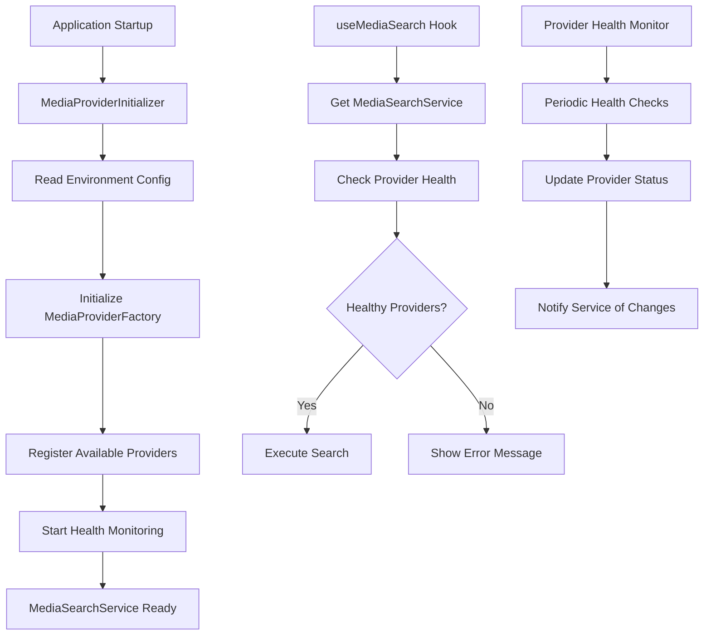

# Design Document

## Overview

This design addresses the media search provider initialization issue by restructuring how MediaProviderFactory is initialized and how providers are registered with the MediaSearchService. The solution ensures proper provider configuration, health monitoring, and graceful error handling.

## Architecture

### Current Issues

1. **MediaProviderFactory Singleton Pattern**: The factory uses a singleton pattern but is never properly initialized with configuration
2. **Missing Provider Registration**: MediaSearchService expects providers to be registered but the factory doesn't call the initialization
3. **Environment Variable Access**: Provider configuration relies on environment variables that may not be properly accessed
4. **Error Handling**: Poor error handling when providers fail to initialize

### Proposed Solution



## Components and Interfaces

### 1. MediaProviderInitializer (New)

A new service responsible for initializing the media provider system at application startup.

```typescript
interface MediaProviderInitializer {
    initialize(): Promise<void>;
    getInitializationStatus(): InitializationStatus;
    reinitialize(): Promise<void>;
}

interface InitializationStatus {
    isInitialized: boolean;
    availableProviders: string[];
    failedProviders: string[];
    errors: string[];
    lastInitialized: Date;
}
```

### 2. Enhanced MediaProviderFactory

Update the existing factory to properly handle initialization and provider registration.

```typescript
interface EnhancedMediaProviderFactory {
    initialize(config: ProviderConfiguration): Promise<void>;
    isInitialized(): boolean;
    getHealthyProviders(): MediaProvider[];
    getInitializationErrors(): string[];
    reinitialize(): Promise<void>;
}
```

### 3. Updated MediaSearchService

Modify the service to work with the properly initialized factory.

```typescript
interface UpdatedMediaSearchService {
    isReady(): boolean;
    getProviderStatus(): ProviderHealthStatus;
    searchMedia(query: MediaSearchQuery): Promise<MediaSearchResult>;
    getReadinessError(): string | null;
}
```

### 4. Provider Health Status

Enhanced status reporting for better error handling.

```typescript
interface ProviderHealthStatus {
    totalProviders: number;
    healthyProviders: number;
    unhealthyProviders: number;
    disabledProviders: number;
    errors: ProviderError[];
    recommendations: string[];
}

interface ProviderError {
    providerId: string;
    error: string;
    type: 'configuration' | 'network' | 'authentication' | 'rate_limit';
    canRetry: boolean;
    retryAfter?: number;
}
```

## Data Models

### Environment Configuration

```typescript
interface MediaSearchEnvironmentConfig {
    unsplash: {
        accessKey?: string;
        secretKey?: string;
        redirectUri?: string;
        enabled: boolean;
    };
    pexels: {
        apiKey?: string;
        enabled: boolean;
    };
    pixabay: {
        apiKey?: string;
        enabled: boolean;
    };
    cache: {
        size: number;
        expiryMinutes: number;
    };
    features: {
        preloadPopular: boolean;
        enableVideoSearch: boolean;
        enableAdvancedFilters: boolean;
    };
}
```

### Initialization Result

```typescript
interface InitializationResult {
    success: boolean;
    initializedProviders: string[];
    failedProviders: ProviderInitializationError[];
    warnings: string[];
    healthMonitorStarted: boolean;
}

interface ProviderInitializationError {
    providerId: string;
    error: string;
    reason: 'missing_api_key' | 'invalid_config' | 'network_error' | 'unknown';
    canRetry: boolean;
}
```

## Error Handling

### Error Categories

1. **Configuration Errors**: Missing or invalid API keys
2. **Network Errors**: Unable to reach provider APIs
3. **Authentication Errors**: Invalid API keys or expired tokens
4. **Rate Limit Errors**: Provider rate limits exceeded
5. **Service Errors**: Provider service unavailable

### Error Recovery Strategies

```typescript
interface ErrorRecoveryStrategy {
    retryable: boolean;
    retryDelay: number;
    maxRetries: number;
    fallbackAction: 'disable_provider' | 'show_error' | 'use_cache';
    userMessage: string;
}

const ERROR_RECOVERY_STRATEGIES: Record<string, ErrorRecoveryStrategy> = {
    missing_api_key: {
        retryable: false,
        retryDelay: 0,
        maxRetries: 0,
        fallbackAction: 'disable_provider',
        userMessage: 'Provider configuration missing. Please check API keys.',
    },
    rate_limit: {
        retryable: true,
        retryDelay: 3600, // 1 hour
        maxRetries: 3,
        fallbackAction: 'disable_provider',
        userMessage: 'Provider temporarily unavailable due to rate limits.',
    },
    network_error: {
        retryable: true,
        retryDelay: 30, // 30 seconds
        maxRetries: 3,
        fallbackAction: 'show_error',
        userMessage:
            'Network error. Please check your connection and try again.',
    },
};
```

### User-Friendly Error Messages

```typescript
interface UserErrorMessage {
    title: string;
    message: string;
    actions: UserAction[];
    severity: 'error' | 'warning' | 'info';
}

interface UserAction {
    label: string;
    action: 'retry' | 'configure' | 'contact_support' | 'dismiss';
    url?: string;
}
```

## Testing Strategy

### Unit Tests

1. **MediaProviderInitializer Tests**

    - Test initialization with valid configuration
    - Test initialization with missing API keys
    - Test initialization with invalid configuration
    - Test reinitialization functionality

2. **MediaProviderFactory Tests**

    - Test provider registration with valid config
    - Test provider registration with invalid config
    - Test health monitoring integration
    - Test error handling and recovery

3. **MediaSearchService Tests**
    - Test service readiness checking
    - Test search with healthy providers
    - Test search with no healthy providers
    - Test error message generation

### Integration Tests

1. **End-to-End Provider Initialization**

    - Test full initialization flow
    - Test provider health monitoring
    - Test error recovery mechanisms

2. **Media Search Workflow**
    - Test search with all providers healthy
    - Test search with some providers unhealthy
    - Test search with no providers available

### Error Scenario Tests

1. **Configuration Errors**

    - Missing API keys
    - Invalid API keys
    - Malformed configuration

2. **Runtime Errors**
    - Network connectivity issues
    - Provider service outages
    - Rate limit scenarios

## Implementation Plan

### Phase 1: Core Infrastructure

1. Create MediaProviderInitializer service
2. Update MediaProviderFactory with proper initialization
3. Add environment configuration parsing
4. Implement basic error handling

### Phase 2: Enhanced Error Handling

1. Add comprehensive error categorization
2. Implement error recovery strategies
3. Add user-friendly error messages
4. Implement retry mechanisms

### Phase 3: Integration and Testing

1. Integrate with existing MediaSearchService
2. Update useMediaSearch hook to use new initialization
3. Add comprehensive test coverage
4. Performance optimization and monitoring

### Phase 4: User Experience

1. Add loading states during initialization
2. Implement graceful degradation
3. Add configuration validation UI
4. Add developer debugging tools

## Configuration Management

### Environment Variable Mapping

```typescript
const ENV_CONFIG_MAPPING = {
    NEXT_PUBLIC_UNSPLASH_ACCESS_KEY: 'unsplash.accessKey',
    NEXT_PUBLIC_UNSPLASH_SECRET_KEY: 'unsplash.secretKey',
    NEXT_PUBLIC_UNSPLASH_REDIRECT_URI: 'unsplash.redirectUri',
    NEXT_PUBLIC_PEXELS_API_KEY: 'pexels.apiKey',
    NEXT_PUBLIC_PIXABAY_API_KEY: 'pixabay.apiKey',
    MEDIA_CACHE_SIZE: 'cache.size',
    MEDIA_CACHE_EXPIRY_MINUTES: 'cache.expiryMinutes',
    MEDIA_PRELOAD_POPULAR: 'features.preloadPopular',
};
```

### Configuration Validation

```typescript
interface ConfigurationValidator {
    validate(config: MediaSearchEnvironmentConfig): ValidationResult;
    getRequiredFields(): string[];
    getOptionalFields(): string[];
}

interface ValidationResult {
    isValid: boolean;
    errors: ValidationError[];
    warnings: ValidationWarning[];
    enabledProviders: string[];
}
```

## Monitoring and Observability

### Health Metrics

1. **Provider Health Scores**: Track provider availability and response times
2. **Initialization Success Rate**: Monitor successful vs failed initializations
3. **Error Rates**: Track error frequency by type and provider
4. **Search Success Rate**: Monitor successful searches vs failures

### Logging Strategy

1. **Initialization Logs**: Detailed logging of provider setup
2. **Error Logs**: Comprehensive error information with context
3. **Performance Logs**: Response times and health metrics
4. **User Action Logs**: Search patterns and error recovery actions

### Debug Information

```typescript
interface DebugInfo {
    initializationStatus: InitializationStatus;
    providerHealth: ProviderHealthStatus;
    environmentConfig: Partial<MediaSearchEnvironmentConfig>;
    recentErrors: ProviderError[];
    performanceMetrics: PerformanceMetrics;
}
```

This design ensures robust provider initialization, comprehensive error handling, and a better user experience when media search encounters issues.
