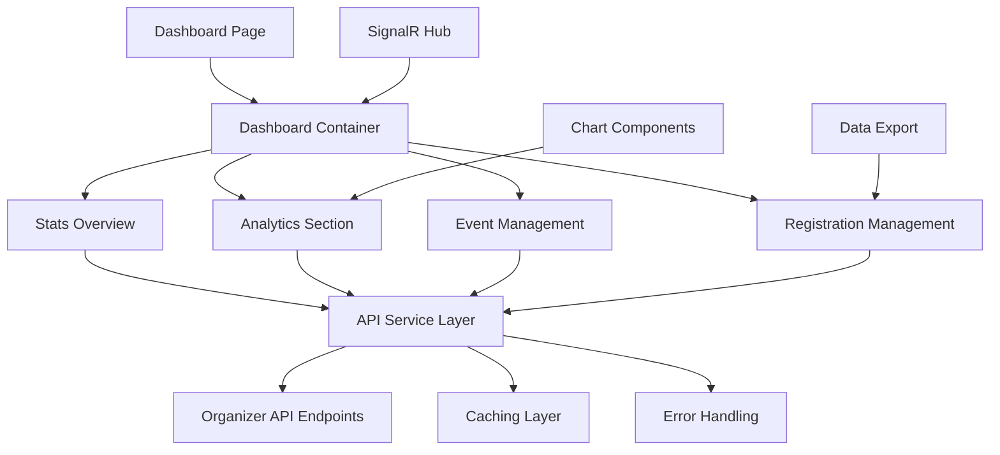
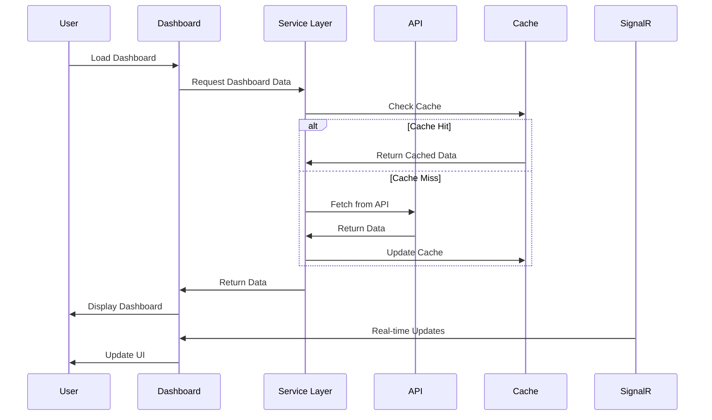

# Design Document

## Overview

The enhanced organizer dashboard will transform the current mock-data implementation into a comprehensive, data-driven management platform. The design leverages the existing API infrastructure while introducing new components for analytics, visualizations, and advanced event management capabilities.

The architecture follows a modular approach with reusable components, efficient data fetching strategies, and responsive design patterns that integrate seamlessly with the existing codebase.

## Architecture

### High-Level Architecture



### Data Flow Architecture



## Components and Interfaces

### Core Components

#### 1. Enhanced Dashboard Container

- **Purpose**: Main orchestrator for dashboard data and layout
- **Props**: `timeRange`, `refreshInterval`, `userId`
- **State Management**: Uses React Query for server state and Zustand for UI state
- **Responsibilities**:
    - Coordinate data fetching from multiple endpoints
    - Manage loading and error states
    - Handle real-time updates via SignalR
    - Provide context for child components

#### 2. Statistics Overview Component

- **Purpose**: Display key performance metrics with visual indicators
- **Data Sources**: `/api/Organizer/dashboard`, `/api/Organizer/statistics`
- **Features**:
    - Animated counters for metrics
    - Trend indicators with percentage changes
    - Responsive grid layout
    - Skeleton loading states

#### 3. Analytics Visualization Suite

- **Purpose**: Comprehensive charts and graphs for data analysis
- **Components**:
    - `RevenueChart`: Line/area chart for revenue trends
    - `EventPerformanceChart`: Bar chart comparing event metrics
    - `AttendeeAnalyticsChart`: Pie/donut charts for demographics
    - `PerformanceHeatmap`: Calendar heatmap for event activity
- **Library**: Chart.js with react-chartjs-2 for consistency with existing patterns

#### 4. Advanced Event Management Table

- **Purpose**: Comprehensive event listing with management capabilities
- **Features**:
    - Server-side pagination and sorting
    - Advanced filtering (status, date, category, performance)
    - Bulk actions (publish, archive, duplicate)
    - Inline editing for quick updates
    - Export functionality

#### 5. Registration Management Interface

- **Purpose**: Attendee and registration oversight
- **Components**:
    - `RegistrationTable`: Paginated registration listing
    - `AttendeeAnalytics`: Demographic breakdowns
    - `RegistrationTrends`: Time-based registration patterns
    - `ExportModal`: Data export with format options

### Service Layer Architecture

#### 1. Organizer API Service

```typescript
interface OrganizerApiService {
    getDashboardData(timeRange: string): Promise<DashboardData>;
    getStatistics(filters: StatisticsFilters): Promise<OrganizerStatistics>;
    getEvents(params: EventQueryParams): Promise<PagedEvents>;
    getRegistrations(params: RegistrationParams): Promise<PagedRegistrations>;
    getRevenueReport(params: RevenueParams): Promise<RevenueReport>;
    getAttendeeAnalytics(eventId?: string): Promise<AttendeeAnalytics>;
    performBulkAction(action: BulkAction): Promise<BulkActionResult>;
}
```

#### 2. Caching Strategy

- **Implementation**: React Query with custom cache keys
- **Cache Duration**:
    - Dashboard stats: 2 minutes
    - Event lists: 5 minutes
    - Analytics data: 10 minutes
    - Static data: 1 hour
- **Invalidation**: Automatic on mutations, manual refresh options

#### 3. Real-time Updates

- **Technology**: SignalR integration with existing infrastructure
- **Events**:
    - New registrations
    - Event status changes
    - Revenue updates
    - System notifications
- **Implementation**: Custom hook `useOrganizerRealtime`

## Data Models

### Enhanced Dashboard Data Model

```typescript
interface DashboardData {
    overview: {
        totalEvents: number;
        activeEvents: number;
        totalRevenue: number;
        totalAttendees: number;
        pendingPayouts: number;
        monthlyGrowth: number;
        revenueGrowth: number;
        attendeeGrowth: number;
    };
    recentEvents: EventSummary[];
    upcomingEvents: EventSummary[];
    recentActivity: ActivityItem[];
    alerts: AlertItem[];
}

interface EventSummary {
    id: string;
    title: string;
    date: string;
    status: EventStatus;
    attendeeCount: number;
    revenue: number;
    registrationTrend: TrendData;
    performance: PerformanceMetrics;
}

interface PerformanceMetrics {
    conversionRate: number;
    engagementScore: number;
    satisfactionRating: number;
    revenuePerAttendee: number;
}
```

### Analytics Data Models

```typescript
interface RevenueAnalytics {
    monthlyRevenue: MonthlyRevenueData[];
    eventRevenue: EventRevenueData[];
    revenueByCategory: CategoryRevenueData[];
    projectedRevenue: ProjectionData[];
}

interface AttendeeAnalytics {
    demographics: DemographicData;
    geographicDistribution: GeographicData[];
    registrationPatterns: RegistrationPatternData[];
    engagementMetrics: EngagementData;
}
```

## Error Handling

### Error Boundary Strategy

- **Global Error Boundary**: Catches and displays user-friendly error messages
- **Component-Level Errors**: Graceful degradation with fallback UI
- **API Error Handling**: Standardized error responses with retry mechanisms

### Error States

1. **Network Errors**: Offline indicator with retry options
2. **Authentication Errors**: Redirect to login with return path
3. **Authorization Errors**: Clear messaging about access restrictions
4. **Data Errors**: Partial data display with error indicators
5. **Validation Errors**: Inline validation with clear guidance

## Testing Strategy

### Unit Testing

- **Components**: React Testing Library for component behavior
- **Services**: Jest for API service logic and data transformations
- **Hooks**: Custom hook testing with React Hooks Testing Library
- **Utilities**: Pure function testing for calculations and formatting

### Integration Testing

- **API Integration**: Mock Service Worker for API endpoint testing
- **Real-time Features**: SignalR connection and message handling
- **Data Flow**: End-to-end data fetching and state management

### Accessibility Testing

- **Automated Testing**: jest-axe for accessibility rule compliance
- **Manual Testing**: Screen reader compatibility and keyboard navigation
- **Visual Testing**: Color contrast and responsive design validation

### Performance Testing

- **Load Testing**: Large dataset rendering performance
- **Memory Testing**: Component cleanup and memory leak detection
- **Network Testing**: Slow connection and offline scenarios

## Performance Considerations

### Optimization Strategies

1. **Code Splitting**: Lazy load analytics components and charts
2. **Virtualization**: Virtual scrolling for large event and registration lists
3. **Memoization**: React.memo and useMemo for expensive calculations
4. **Debouncing**: Search and filter input debouncing
5. **Image Optimization**: Lazy loading and responsive images for event thumbnails

### Caching Implementation

- **Browser Caching**: Service worker for offline capability
- **Memory Caching**: React Query for in-memory data caching
- **Local Storage**: User preferences and dashboard configurations

### Bundle Optimization

- **Tree Shaking**: Remove unused chart components and utilities
- **Dynamic Imports**: Load chart libraries only when needed
- **Compression**: Gzip compression for API responses

## Security Considerations

### Data Protection

- **API Security**: JWT token validation and refresh handling
- **Data Sanitization**: Input validation and XSS prevention
- **Access Control**: Role-based feature access and data filtering

### Privacy Compliance

- **Data Minimization**: Only fetch required data for current view
- **Audit Logging**: Track data access and modifications
- **Data Retention**: Respect data retention policies for analytics

## Migration Strategy

### Phased Implementation

1. **Phase 1**: Replace mock data with real API integration
2. **Phase 2**: Add basic analytics and visualizations
3. **Phase 3**: Implement advanced event management features
4. **Phase 4**: Add real-time updates and notifications
5. **Phase 5**: Performance optimization and advanced features

### Backward Compatibility

- **Graceful Degradation**: Fallback to existing functionality if new features fail
- **Feature Flags**: Toggle new features for gradual rollout
- **Data Migration**: Smooth transition from mock to real data

## Monitoring and Analytics

### Performance Monitoring

- **Core Web Vitals**: Track loading performance and user experience
- **Error Tracking**: Monitor and alert on component errors
- **Usage Analytics**: Track feature adoption and user behavior

### Business Metrics

- **Dashboard Usage**: Track which features are most valuable
- **User Engagement**: Monitor time spent and actions taken
- **Feature Effectiveness**: Measure impact on organizer success
