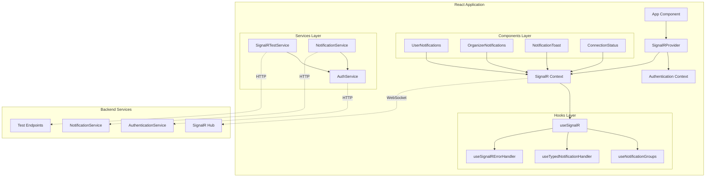

# SignalR Integration Rewrite - Design Document

## Overview

This design document outlines the architecture and implementation approach for reimplementing the SignalR real-time notification system in the Revlr application. The design follows the comprehensive patterns from the React SignalR Integration Guide and replaces the current basic implementation with a production-ready, type-safe, and robust real-time communication system.

The new architecture will provide a layered approach with proper separation of concerns, comprehensive error handling, and seamless integration with existing application systems.

## Architecture

### High-Level Architecture



### Component Architecture

The system is organized into several key layers:

1. **Provider Layer**: Context providers for SignalR connection and authentication
2. **Hooks Layer**: Custom hooks for connection management, error handling, and notifications
3. **Components Layer**: UI components for displaying notifications and connection status
4. **Services Layer**: API services for testing and integration
5. **Types Layer**: Comprehensive TypeScript definitions

## Components and Interfaces

### Core Interfaces

#### SignalR Connection Interface

```typescript
interface SignalRConnection {
    connection: HubConnection | null;
    connectionState: HubConnectionState;
    error: Error | null;
    isConnected: boolean;
    isConnecting: boolean;
    isReconnecting: boolean;
    startConnection: () => Promise<HubConnection>;
    stopConnection: () => Promise<void>;
}
```

#### Notification Message Interface

```typescript
interface NotificationMessage {
    id: string;
    type: NotificationType;
    title: string;
    message: string;
    timestamp: string;
    data?:
        | EventNotificationData
        | PaymentNotificationData
        | FinancingNotificationData;
    priority: NotificationPriority;
    actionUrl?: string;
    metadata?: Record<string, any>;
}
```

#### Error Handling Interface

```typescript
interface SignalRError {
    type: SignalRErrorType;
    message: string;
    originalError?: Error;
    timestamp: Date;
    connectionState?: HubConnectionState;
}
```

### Core Components

#### 1. SignalR Provider (`src/providers/SignalRProvider.tsx`)

- **Purpose**: Provides SignalR connection context to the entire application
- **Responsibilities**:
    - Manages connection lifecycle
    - Handles authentication integration
    - Provides connection state to child components
    - Manages automatic reconnection
- **Integration**: Wraps the main application and integrates with AuthProvider

#### 2. SignalR Hook (`src/hooks/useSignalR.ts`)

- **Purpose**: Core hook for managing SignalR connections
- **Responsibilities**:
    - Creates and manages HubConnection
    - Handles connection state changes
    - Implements retry logic with exponential backoff
    - Manages event handlers and cleanup
- **Features**:
    - Automatic reconnection with configurable intervals
    - Connection state tracking
    - Error categorization and handling
    - Token refresh integration

#### 3. Notification Groups Hook (`src/hooks/useNotificationGroups.ts`)

- **Purpose**: Manages user group membership for targeted notifications
- **Responsibilities**:
    - Joins appropriate groups based on user role
    - Handles group membership changes
    - Manages group cleanup on disconnect
- **Logic**:
    - Regular users join user-specific groups
    - Organizers join both user and organizer groups
    - Automatic rejoin on reconnection

#### 4. Typed Notification Handler (`src/hooks/useTypedNotificationHandler.ts`)

- **Purpose**: Provides type-safe notification handling with proper routing
- **Responsibilities**:
    - Validates incoming notifications
    - Routes notifications based on type
    - Handles navigation and UI updates
    - Manages notification display logic
- **Features**:
    - Full TypeScript type safety
    - Automatic routing to relevant pages
    - Priority-based display logic
    - Toast notification integration

#### 5. Error Handler (`src/hooks/useSignalRErrorHandler.ts`)

- **Purpose**: Comprehensive error handling and recovery
- **Responsibilities**:
    - Categorizes different error types
    - Implements recovery strategies
    - Provides user feedback
    - Logs errors for debugging
- **Error Types**:
    - Authentication failures
    - Network connectivity issues
    - Hub method errors
    - Unexpected errors

### Notification Components

#### 1. User Notifications (`src/components/notifications/UserNotifications.tsx`)

- **Purpose**: Displays notifications for regular users
- **Features**:
    - Event registration confirmations
    - Payment status updates
    - Financing application updates
    - System notifications
- **UI Elements**:
    - Notification list with priority indicators
    - Action buttons for navigation
    - Read/unread status management
    - Notification dismissal

#### 2. Organizer Notifications (`src/components/notifications/OrganizerNotifications.tsx`)

- **Purpose**: Displays organizer-specific notifications
- **Features**:
    - New event registrations
    - Revenue updates
    - Event status changes
    - Financing application reviews
- **UI Elements**:
    - Event-specific notification grouping
    - Revenue tracking displays
    - Registration management links
    - Priority-based styling

#### 3. Connection Status (`src/components/notifications/ConnectionStatus.tsx`)

- **Purpose**: Shows real-time connection status to users
- **Features**:
    - Connection state indicator
    - Reconnection progress
    - Error status display
    - Manual reconnect button
- **States**:
    - Connected (green indicator)
    - Connecting (yellow indicator)
    - Disconnected (red indicator)
    - Reconnecting (animated indicator)

## Data Models

### Notification Type System

The system supports comprehensive notification types that mirror the backend C# models:

#### Event Notifications

- `EventRegistration`: User registered for an event
- `EventUpdate`: Event details changed
- `EventPublished`: Event was published
- `EventCancelled`: Event was cancelled

#### Payment Notifications

- `PaymentCompleted`: Payment processed successfully
- `PaymentFailed`: Payment processing failed
- `PaymentPending`: Payment is being processed
- `RecurringPaymentProcessed`: Recurring payment completed

#### Financing Notifications

- `FinancingApplicationSubmitted`: New financing application
- `FinancingApplicationApproved`: Application approved
- `FinancingApplicationRejected`: Application rejected
- `FinancingPaymentDue`: Payment due reminder

#### System Notifications

- `SystemMaintenance`: Scheduled maintenance
- `SystemUpdate`: System updates available

### Data Validation

All notification data is validated using TypeScript type guards:

```typescript
function isEventNotificationData(data: any): data is EventNotificationData {
    return (
        data &&
        typeof data.eventId === 'string' &&
        typeof data.eventTitle === 'string' &&
        typeof data.organizerName === 'string' &&
        typeof data.eventDate === 'string'
    );
}
```

## Error Handling

### Error Categorization

The system categorizes errors into specific types for appropriate handling:

1. **Authentication Errors**: Token expired, unauthorized access
2. **Connection Errors**: Network issues, server unavailable
3. **Hub Method Errors**: Invalid method calls, parameter errors
4. **Unexpected Errors**: Unknown errors requiring investigation

### Recovery Strategies

#### Authentication Recovery

- Automatic token refresh
- Redirect to login if refresh fails
- Graceful degradation of features

#### Connection Recovery

- Exponential backoff retry (0ms, 2s, 10s, 30s)
- User notification of connection status
- Automatic group rejoin on reconnection

#### Hub Method Recovery

- Retry with exponential backoff
- Fallback to polling for critical operations
- User notification of temporary issues

### Error Logging

All errors are logged with comprehensive context:

- Error type and message
- Connection state at time of error
- User context and authentication status
- Timestamp and session information

## Testing Strategy

### Unit Testing

#### Hook Testing

- Connection lifecycle management
- Error handling scenarios
- State transitions
- Cleanup operations

#### Component Testing

- Notification rendering
- User interactions
- Error state display
- Navigation functionality

#### Service Testing

- API integration
- Error handling
- Data validation
- Authentication flow

### Integration Testing

#### End-to-End Scenarios

- Complete notification flow
- Authentication integration
- Error recovery
- Multi-user scenarios

#### Performance Testing

- Connection load testing
- Notification throughput
- Memory usage monitoring
- Reconnection performance

### Testing Tools

#### Mock Services

- SignalR connection mocking
- Authentication service mocking
- Notification data factories
- Error scenario simulation

#### Test Utilities

- Connection state helpers
- Notification assertion helpers
- Error injection utilities
- Performance measurement tools

## Security Considerations

### Authentication Security

- JWT token validation
- Automatic token refresh
- Secure token storage
- Session management

### Data Security

- Input sanitization
- XSS prevention
- Content validation
- Rate limiting

### Connection Security

- Encrypted WebSocket connections
- Origin validation
- CORS configuration
- Request authentication

## Performance Optimization

### Connection Management

- Connection pooling
- Automatic reconnection
- Page visibility handling
- Resource cleanup

### Notification Processing

- Batch processing
- Debounced updates
- Memory management
- History limiting

### UI Performance

- Virtual scrolling for large lists
- Lazy loading of components
- Optimized re-rendering
- Efficient state updates

## Migration Strategy

### Phase 1: Infrastructure Setup

- Install new SignalR dependencies
- Create core types and interfaces
- Set up provider architecture
- Implement basic connection management

### Phase 2: Core Functionality

- Implement notification handling
- Add error handling and recovery
- Create user group management
- Build testing infrastructure

### Phase 3: UI Integration

- Create notification components
- Integrate with existing UI systems
- Add connection status indicators
- Implement toast notifications

### Phase 4: Advanced Features

- Add performance optimizations
- Implement comprehensive testing
- Add debugging and monitoring tools
- Complete documentation

### Phase 5: Migration and Cleanup

- Migrate existing functionality
- Remove old SignalR implementation
- Update related components
- Performance testing and optimization

## Integration Points

### Authentication Integration

- Uses existing AuthProvider for token management
- Integrates with token refresh mechanisms
- Respects user authentication state
- Handles logout scenarios

### Routing Integration

- Uses React Router for navigation
- Supports deep linking from notifications
- Maintains routing state during navigation
- Handles protected route access

### State Management Integration

- Works with existing Zustand stores
- Provides real-time state updates
- Maintains consistency with server state
- Supports optimistic updates

### UI System Integration

- Uses existing toast notification system
- Integrates with design system components
- Supports theming and accessibility
- Maintains consistent user experience

## Monitoring and Debugging

### Connection Monitoring

- Real-time connection health checks
- Latency measurement
- Error rate tracking
- User session monitoring

### Performance Monitoring

- Memory usage tracking
- CPU usage monitoring
- Network traffic analysis
- User experience metrics

### Debug Tools

- Connection state inspector
- Notification history viewer
- Error log analyzer
- Performance profiler

This design provides a comprehensive, production-ready SignalR integration that addresses all the requirements while maintaining high code quality, type safety, and user experience standards.
