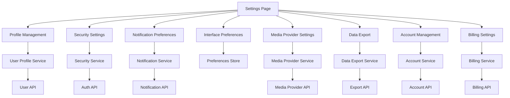

# Design Document

## Overview

The User Settings Management feature provides a comprehensive interface for organizers to manage their account information, preferences, security settings, and integrations. The design follows a modular, tab-based approach that integrates seamlessly with the existing Revlr design system and authentication infrastructure.

## Architecture

### High-Level Architecture



### Component Hierarchy (Feature-Scoped Architecture)

```
src/features/settings/
├── SettingsPage.tsx (< 100 lines - routing & layout)
├── components/
│   ├── SettingsLayout.tsx (< 150 lines - navigation & content wrapper)
│   ├── SettingsNavigation.tsx (< 100 lines - tab navigation)
│   └── SettingsContent.tsx (< 50 lines - content container)
├── profile/
│   ├── ProfileSettings.tsx (< 200 lines - main profile container)
│   ├── components/
│   │   ├── ProfileForm.tsx (< 150 lines - basic info form)
│   │   ├── AvatarUpload.tsx (< 100 lines - avatar management)
│   │   ├── ContactInformation.tsx (< 100 lines - contact details)
│   │   ├── PersonalDetails.tsx (< 100 lines - name, bio, etc.)
│   │   └── OrganizationInfo.tsx (< 100 lines - org details)
│   ├── hooks/
│   │   ├── useProfileUpdate.ts (< 100 lines)
│   │   └── useAvatarUpload.ts (< 80 lines)
│   └── types/
│       └── profile.types.ts (< 50 lines)
├── security/
│   ├── SecuritySettings.tsx (< 150 lines - main security container)
│   ├── components/
│   │   ├── EmailChangeForm.tsx (< 120 lines - email change flow)
│   │   ├── SessionManager.tsx (< 150 lines - active sessions)
│   │   ├── SessionItem.tsx (< 80 lines - individual session)
│   │   ├── PasswordSettings.tsx (< 100 lines - password management)
│   │   └── TwoFactorAuth.tsx (< 200 lines - 2FA setup)
│   ├── hooks/
│   │   ├── useSessionManager.ts (< 100 lines)
│   │   ├── useEmailChange.ts (< 80 lines)
│   │   └── useTwoFactor.ts (< 120 lines)
│   └── types/
│       └── security.types.ts (< 80 lines)
├── notifications/
│   ├── NotificationSettings.tsx (< 100 lines - main container)
│   ├── components/
│   │   ├── EmailNotifications.tsx (< 120 lines - email prefs)
│   │   ├── PushNotifications.tsx (< 100 lines - push prefs)
│   │   ├── InAppNotifications.tsx (< 80 lines - in-app prefs)
│   │   ├── NotificationFrequency.tsx (< 60 lines - frequency selector)
│   │   └── NotificationToggle.tsx (< 40 lines - reusable toggle)
│   ├── hooks/
│   │   └── useNotificationPreferences.ts (< 100 lines)
│   └── types/
│       └── notifications.types.ts (< 60 lines)
├── interface/
│   ├── InterfaceSettings.tsx (< 100 lines - main container)
│   ├── components/
│   │   ├── ThemeSelector.tsx (< 80 lines - theme selection)
│   │   ├── LayoutPreferences.tsx (< 100 lines - layout options)
│   │   ├── DefaultViews.tsx (< 80 lines - default view settings)
│   │   ├── LanguageSelector.tsx (< 60 lines - language selection)
│   │   └── DateTimeFormat.tsx (< 60 lines - format preferences)
│   ├── hooks/
│   │   └── useInterfacePreferences.ts (< 100 lines)
│   └── types/
│       └── interface.types.ts (< 50 lines)
├── media-providers/
│   ├── MediaProviderSettings.tsx (< 100 lines - main container)
│   ├── components/
│   │   ├── ConnectedProviders.tsx (< 120 lines - provider list)
│   │   ├── ProviderCard.tsx (< 80 lines - individual provider)
│   │   ├── ConnectionDialog.tsx (< 100 lines - connection flow)
│   │   ├── PermissionManager.tsx (< 100 lines - permission settings)
│   │   └── ProviderStatus.tsx (< 40 lines - status indicator)
│   ├── hooks/
│   │   ├── useMediaProviders.ts (< 100 lines)
│   │   └── useProviderConnection.ts (< 80 lines)
│   └── types/
│       └── media-providers.types.ts (< 60 lines)
├── data-export/
│   ├── DataExportSettings.tsx (< 100 lines - main container)
│   ├── components/
│   │   ├── ExportRequest.tsx (< 120 lines - new export request)
│   │   ├── ExportHistory.tsx (< 100 lines - export history list)
│   │   ├── ExportItem.tsx (< 80 lines - individual export)
│   │   ├── ExportOptions.tsx (< 100 lines - export configuration)
│   │   └── DownloadButton.tsx (< 40 lines - download component)
│   ├── hooks/
│   │   ├── useDataExport.ts (< 100 lines)
│   │   └── useExportHistory.ts (< 60 lines)
│   └── types/
│       └── data-export.types.ts (< 50 lines)
├── billing/
│   ├── BillingSettings.tsx (< 100 lines - main container)
│   ├── components/
│   │   ├── PaymentMethods.tsx (< 150 lines - payment method list)
│   │   ├── PaymentMethodCard.tsx (< 80 lines - individual method)
│   │   ├── AddPaymentMethod.tsx (< 120 lines - add new method)
│   │   ├── BillingHistory.tsx (< 100 lines - transaction history)
│   │   ├── InvoiceItem.tsx (< 60 lines - individual invoice)
│   │   └── SubscriptionInfo.tsx (< 100 lines - subscription details)
│   ├── hooks/
│   │   ├── usePaymentMethods.ts (< 100 lines)
│   │   ├── useBillingHistory.ts (< 60 lines)
│   │   └── useSubscription.ts (< 80 lines)
│   └── types/
│       └── billing.types.ts (< 80 lines)
├── account/
│   ├── AccountSettings.tsx (< 100 lines - main container)
│   ├── components/
│   │   ├── AccountDeletion.tsx (< 150 lines - deletion flow)
│   │   ├── DeletionConfirmation.tsx (< 100 lines - confirmation dialog)
│   │   ├── DataRetention.tsx (< 80 lines - retention info)
│   │   ├── AccountInfo.tsx (< 60 lines - account overview)
│   │   └── DangerZone.tsx (< 80 lines - dangerous actions)
│   ├── hooks/
│   │   ├── useAccountDeletion.ts (< 100 lines)
│   │   └── useAccountInfo.ts (< 60 lines)
│   └── types/
│       └── account.types.ts (< 40 lines)
├── shared/
│   ├── components/
│   │   ├── SettingsCard.tsx (< 60 lines - reusable card)
│   │   ├── SettingsSection.tsx (< 40 lines - section wrapper)
│   │   ├── SaveButton.tsx (< 40 lines - save action button)
│   │   ├── LoadingSpinner.tsx (< 30 lines - loading indicator)
│   │   └── ErrorMessage.tsx (< 40 lines - error display)
│   ├── hooks/
│   │   ├── useSettingsNavigation.ts (< 60 lines)
│   │   ├── useAutoSave.ts (< 80 lines)
│   │   └── useSettingsValidation.ts (< 100 lines)
│   ├── utils/
│   │   ├── validation.ts (< 100 lines)
│   │   ├── formatting.ts (< 60 lines)
│   │   └── constants.ts (< 40 lines)
│   └── types/
│       ├── common.types.ts (< 60 lines)
│       └── api.types.ts (< 80 lines)
├── stores/
│   ├── settingsStore.ts (< 200 lines - main settings store)
│   ├── profileStore.ts (< 100 lines - profile-specific store)
│   ├── securityStore.ts (< 100 lines - security-specific store)
│   └── preferencesStore.ts (< 80 lines - preferences store)
├── services/
│   ├── SettingsService.ts (< 150 lines - main service)
│   ├── ProfileService.ts (< 100 lines - profile operations)
│   ├── SecurityService.ts (< 120 lines - security operations)
│   ├── NotificationService.ts (< 80 lines - notification operations)
│   ├── MediaProviderService.ts (< 100 lines - provider operations)
│   ├── ExportService.ts (< 80 lines - export operations)
│   └── BillingService.ts (< 100 lines - billing operations)
└── index.ts (< 20 lines - feature exports)
```

## Component Design Principles

Each component follows these strict guidelines:

- **Maximum 300 lines of code** (preferably under 200)
- **Single responsibility principle** - one clear purpose per component
- **Feature-scoped** - components belong to their specific feature domain
- **Reusable within feature** - shared components in feature's shared folder
- **Cross-feature shared components** - only in global shared folder

## Components and Interfaces

### Core Container Components

#### SettingsPage (< 100 lines)

Main routing and layout orchestrator.

```typescript
interface SettingsPageProps {
    initialTab?: SettingsTab;
}

type SettingsTab =
    | 'profile'
    | 'security'
    | 'notifications'
    | 'interface'
    | 'media-providers'
    | 'data-export'
    | 'billing'
    | 'account';
```

#### SettingsLayout (< 150 lines)

Responsive layout with navigation and content areas.

```typescript
interface SettingsLayoutProps {
    activeTab: SettingsTab;
    onTabChange: (tab: SettingsTab) => void;
    children: React.ReactNode;
}
```

### Feature-Specific Component Interfaces

#### Profile Feature Components

**ProfileSettings (< 200 lines)** - Main profile container

```typescript
interface ProfileSettingsProps {
    className?: string;
}
```

**ProfileForm (< 150 lines)** - Basic profile information

```typescript
interface ProfileFormProps {
    user: UserView;
    onSave: (data: ProfileFormData) => Promise<void>;
    isLoading?: boolean;
}

interface ProfileFormData {
    firstName: string;
    lastName: string;
    phoneNumber?: string;
}
```

**AvatarUpload (< 100 lines)** - Avatar management

```typescript
interface AvatarUploadProps {
    currentAvatar?: string;
    onUpload: (file: File) => Promise<string>;
    onRemove: () => Promise<void>;
    isLoading?: boolean;
}
```

#### Security Feature Components

**SecuritySettings (< 150 lines)** - Main security container

```typescript
interface SecuritySettingsProps {
    className?: string;
}
```

**SessionItem (< 80 lines)** - Individual session display

```typescript
interface SessionItemProps {
    session: UserSession;
    onRevoke: (sessionId: string) => Promise<void>;
    isRevoking?: boolean;
}

interface UserSession {
    id: string;
    deviceInfo: string;
    location?: string;
    lastActivity: Date;
    isCurrentSession: boolean;
}
```

#### Shared Components (< 60 lines each)

**SettingsCard** - Reusable card wrapper

```typescript
interface SettingsCardProps {
    title: string;
    description?: string;
    children: React.ReactNode;
    className?: string;
}
```

**NotificationToggle** - Reusable toggle component

```typescript
interface NotificationToggleProps {
    label: string;
    description?: string;
    checked: boolean;
    onChange: (checked: boolean) => void;
    disabled?: boolean;
}
```

### Core Components

#### SettingsPage

Main container component that provides routing and layout structure.

```typescript
interface SettingsPageProps {
    initialTab?: SettingsTab;
}

type SettingsTab =
    | 'profile'
    | 'security'
    | 'notifications'
    | 'interface'
    | 'media-providers'
    | 'data-export'
    | 'billing'
    | 'account';
```

#### SettingsLayout

Responsive layout component with navigation and content areas.

```typescript
interface SettingsLayoutProps {
    activeTab: SettingsTab;
    onTabChange: (tab: SettingsTab) => void;
    children: React.ReactNode;
}
```

#### ProfileSettings

Manages user profile information with real-time validation.

```typescript
interface ProfileSettingsProps {
    user: UserView;
    onUpdate: (updates: Partial<UserProfileUpdate>) => Promise<void>;
    isLoading?: boolean;
}

interface UserProfileUpdate {
    firstName?: string;
    lastName?: string;
    phoneNumber?: string;
    bio?: string;
    organization?: string;
    website?: string;
    timezone?: string;
    language?: string;
}
```

#### SecuritySettings

Handles security-related settings and session management.

```typescript
interface SecuritySettingsProps {
    user: UserView;
    sessions: UserSession[];
    onEmailChange: (newEmail: string) => Promise<void>;
    onSessionRevoke: (sessionId: string) => Promise<void>;
    onRevokeAllSessions: () => Promise<void>;
}

interface UserSession {
    id: string;
    deviceInfo: string;
    location?: string;
    lastActivity: Date;
    isCurrentSession: boolean;
}
```

#### NotificationSettings

Manages notification preferences across different channels.

```typescript
interface NotificationSettingsProps {
    preferences: NotificationPreferences;
    onUpdate: (preferences: Partial<NotificationPreferences>) => Promise<void>;
}

interface NotificationPreferences {
    email: {
        eventUpdates: boolean;
        registrationAlerts: boolean;
        paymentNotifications: boolean;
        marketingEmails: boolean;
        securityAlerts: boolean;
    };
    push: {
        enabled: boolean;
        eventReminders: boolean;
        registrationAlerts: boolean;
        paymentNotifications: boolean;
    };
    inApp: {
        enabled: boolean;
        eventUpdates: boolean;
        systemNotifications: boolean;
    };
    frequency: 'immediate' | 'daily' | 'weekly';
}
```

### Service Layer (Feature-Scoped Services)

Each service is focused on a specific domain and kept under 150 lines:

#### ProfileService (< 100 lines)

Handles profile-related operations only.

```typescript
class ProfileService {
    async getProfile(): Promise<ExtendedUserProfile>;
    async updateProfile(updates: ProfileFormData): Promise<UserView>;
    async uploadAvatar(file: File): Promise<string>;
    async removeAvatar(): Promise<void>;
}
```

#### SecurityService (< 120 lines)

Manages security and session operations.

```typescript
class SecurityService {
    async changeEmail(newEmail: string): Promise<void>;
    async getActiveSessions(): Promise<UserSession[]>;
    async revokeSession(sessionId: string): Promise<void>;
    async revokeAllSessions(): Promise<void>;
    async enableTwoFactor(): Promise<TwoFactorSetup>;
    async disableTwoFactor(code: string): Promise<void>;
}
```

#### NotificationService (< 80 lines)

Handles notification preferences.

```typescript
class NotificationService {
    async getPreferences(): Promise<NotificationPreferences>;
    async updatePreferences(
        preferences: Partial<NotificationPreferences>
    ): Promise<void>;
    async testNotification(type: NotificationType): Promise<void>;
}
```

#### MediaProviderService (< 100 lines)

Manages external media provider integrations.

```typescript
interface MediaProvider {
    id: string;
    name: string;
    isConnected: boolean;
    connectedAt?: Date;
    permissions: string[];
    status: 'active' | 'expired' | 'error';
}

class MediaProviderService {
    async getConnectedProviders(): Promise<MediaProvider[]>;
    async connectProvider(providerId: string): Promise<string>;
    async disconnectProvider(providerId: string): Promise<void>;
    async refreshConnection(providerId: string): Promise<void>;
}
```

#### ExportService (< 80 lines)

Handles data export operations.

```typescript
class ExportService {
    async requestExport(options: ExportOptions): Promise<DataExportRequest>;
    async getExportHistory(): Promise<DataExportRequest[]>;
    async downloadExport(exportId: string): Promise<Blob>;
    async cancelExport(exportId: string): Promise<void>;
}
```

### State Management (Feature-Scoped Stores)

Each store is focused on a specific domain and kept under 200 lines:

#### Main Settings Store (< 200 lines)

Central coordination store for settings navigation and shared state.

```typescript
interface SettingsState {
    activeTab: SettingsTab;
    isInitialized: boolean;

    // Actions
    setActiveTab: (tab: SettingsTab) => void;
    initialize: () => Promise<void>;
}
```

#### Profile Store (< 100 lines)

Manages profile-specific state.

```typescript
interface ProfileState {
    profile: ExtendedUserProfile | null;
    isLoading: boolean;

    // Actions
    updateProfile: (updates: ProfileFormData) => Promise<void>;
    uploadAvatar: (file: File) => Promise<void>;
    removeAvatar: () => Promise<void>;
}
```

#### Security Store (< 100 lines)

Manages security-related state.

```typescript
interface SecurityState {
    sessions: UserSession[];
    isLoading: boolean;

    // Actions
    refreshSessions: () => Promise<void>;
    revokeSession: (sessionId: string) => Promise<void>;
    revokeAllSessions: () => Promise<void>;
    changeEmail: (newEmail: string) => Promise<void>;
}
```

#### Preferences Store (< 80 lines)

Manages user preferences (notifications, interface).

```typescript
interface PreferencesState {
    notifications: NotificationPreferences | null;
    interface: InterfacePreferences | null;

    // Actions
    updateNotifications: (
        prefs: Partial<NotificationPreferences>
    ) => Promise<void>;
    updateInterface: (prefs: Partial<InterfacePreferences>) => Promise<void>;
}
```

## Data Models

### Extended User Profile

```typescript
interface ExtendedUserProfile extends UserView {
    bio?: string;
    organization?: string;
    website?: string;
    timezone?: string;
    language?: string;
    avatarUrl?: string;
    createdAt: Date;
    lastLoginAt: Date;
    emailVerified: boolean;
}
```

### Interface Preferences

```typescript
interface InterfacePreferences {
    theme: 'light' | 'dark' | 'system';
    dashboardLayout: 'compact' | 'comfortable' | 'spacious';
    defaultEventView: 'grid' | 'list' | 'table';
    defaultAnalyticsView: 'overview' | 'detailed' | 'custom';
    sidebarCollapsed: boolean;
    showWelcomeMessages: boolean;
    dateFormat: 'MM/DD/YYYY' | 'DD/MM/YYYY' | 'YYYY-MM-DD';
    timeFormat: '12h' | '24h';
    currency: string;
    language: string;
}
```

### Data Export Request

```typescript
interface DataExportRequest {
    id: string;
    requestedAt: Date;
    completedAt?: Date;
    status: 'pending' | 'processing' | 'completed' | 'failed';
    downloadUrl?: string;
    expiresAt?: Date;
    fileSize?: number;
    includeEvents: boolean;
    includeRegistrations: boolean;
    includeAnalytics: boolean;
    includeSettings: boolean;
}
```

### Account Deletion Request

```typescript
interface AccountDeletionRequest {
    confirmationEmail: string;
    reason?: string;
    feedback?: string;
    scheduledDeletionDate: Date;
    immediateDataRemoval: boolean;
}
```

## Error Handling

### Error Types

```typescript
type SettingsError =
    | 'VALIDATION_ERROR'
    | 'UNAUTHORIZED'
    | 'EMAIL_ALREADY_EXISTS'
    | 'INVALID_SESSION'
    | 'PROVIDER_CONNECTION_FAILED'
    | 'EXPORT_LIMIT_EXCEEDED'
    | 'ACCOUNT_DELETION_BLOCKED'
    | 'NETWORK_ERROR'
    | 'SERVER_ERROR';

interface SettingsErrorInfo {
    type: SettingsError;
    message: string;
    field?: string;
    details?: Record<string, any>;
}
```

### Error Handling Strategy

- Form validation errors display inline with specific field feedback
- Network errors show toast notifications with retry options
- Critical errors (auth failures) redirect to login with context preservation
- Optimistic updates with rollback on failure
- Graceful degradation for non-critical features

## Testing Strategy

### Unit Tests

- Component rendering with different props and states
- Form validation logic and error handling
- Service layer methods and API interactions
- Store actions and state updates
- Utility functions and helpers

### Integration Tests

- Complete settings workflows (profile update, email change, etc.)
- Authentication integration with settings operations
- Media provider OAuth flows
- Data export and download processes
- Account deletion workflows

### E2E Tests

- Full user journey through settings sections
- Cross-browser compatibility for critical flows
- Mobile responsiveness and touch interactions
- Accessibility compliance with screen readers
- Performance under various network conditions

### Accessibility Testing

- Keyboard navigation through all settings sections
- Screen reader compatibility and ARIA labels
- Color contrast compliance
- Focus management and skip links
- Error announcement and form validation feedback

## Security Considerations

### Data Protection

- Sensitive data encryption in transit and at rest
- Secure token handling for API requests
- Input sanitization and validation
- CSRF protection for state-changing operations
- Rate limiting for sensitive operations (email changes, exports)

### Authentication & Authorization

- Session validation for all settings operations
- Multi-factor authentication for critical changes
- Email verification for email address changes
- Secure logout and session management
- Permission-based access to different settings sections

### Privacy Compliance

- GDPR-compliant data export functionality
- Clear data retention policies
- User consent management for data processing
- Audit logging for sensitive operations
- Secure data deletion processes

## Performance Optimizations

### Loading Strategies

- Lazy loading of settings sections
- Progressive enhancement for non-critical features
- Optimistic updates with background synchronization
- Intelligent caching of user preferences
- Debounced auto-save for form inputs

### Bundle Optimization

- Code splitting by settings section
- Dynamic imports for heavy components
- Tree shaking of unused utilities
- Optimized image loading for avatars
- Minimal initial bundle size

### Caching Strategy

- Browser caching for static assets
- Memory caching for frequently accessed data
- Intelligent cache invalidation
- Offline support for viewing settings
- Background sync when connectivity returns

## Mobile Responsiveness

### Responsive Design

- Mobile-first approach with progressive enhancement
- Touch-friendly interface elements
- Optimized layouts for different screen sizes
- Swipe gestures for tab navigation
- Adaptive content density

### Mobile-Specific Features

- Native file picker integration for avatar uploads
- Platform-specific notification settings
- Biometric authentication support
- Offline capability for viewing settings
- Reduced data usage modes

## Implementation Phases

### Phase 1: Core Settings Infrastructure

- Basic settings page layout and navigation
- Profile settings with form validation
- Integration with existing auth system
- Basic error handling and loading states

### Phase 2: Security and Notifications

- Security settings and session management
- Notification preferences management
- Email change workflow with verification
- Enhanced error handling and user feedback

### Phase 3: Advanced Features

- Interface customization and theming
- Media provider integration management
- Data export functionality
- Billing and subscription management

### Phase 4: Account Management

- Account deletion workflow
- Advanced security features
- Audit logging and activity history
- Performance optimizations and caching

This design provides a comprehensive foundation for implementing a robust, secure, and user-friendly settings management system that integrates seamlessly with the existing Revlr platform architecture.
